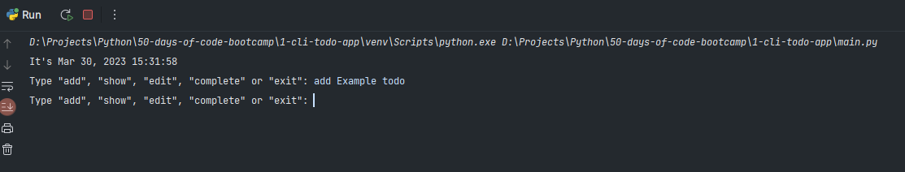
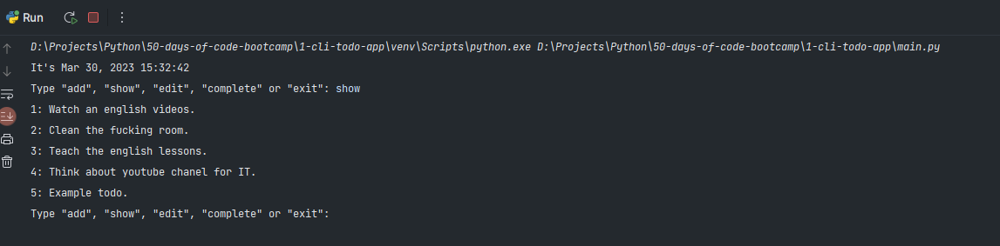
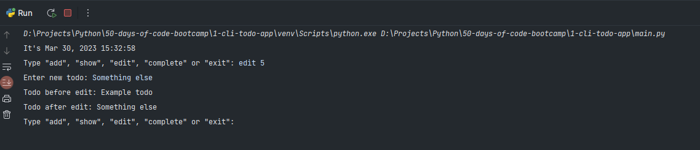
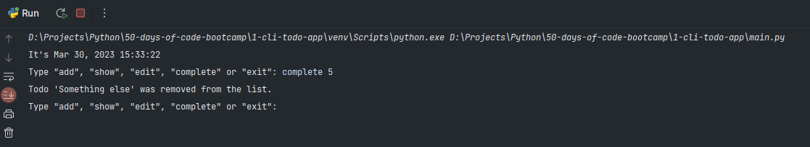
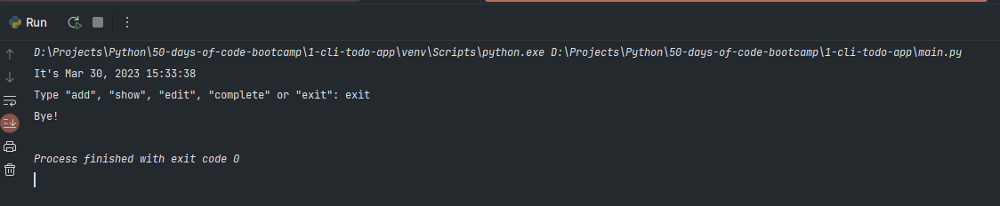

# The GUI TODO application.

<!-- Технологии -->
### Technologies used

    <code></code>
    <code></code>

## Application functionality:

#### adding todo:

#### show todo:

#### editing todo:

#### completion of todo:

#### exiting the application:

